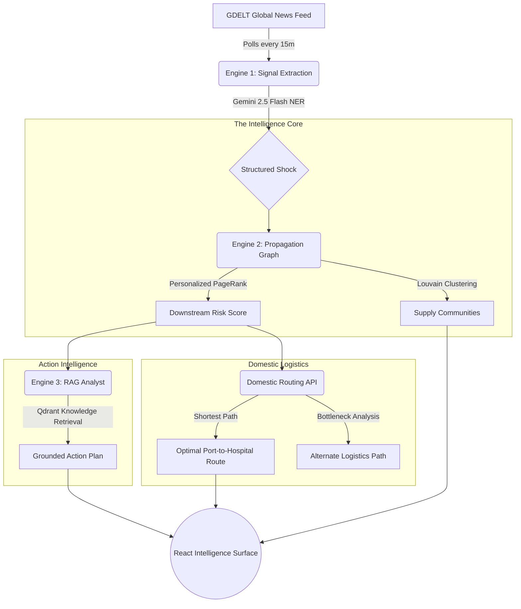

# ShockMap — Multi-Sector Supply Chain Intelligence Platform

> **"Know which critical inputs will run short — before headlines do."**

ShockMap is a high-fidelity, three-engine intelligence platform designed to detect, propagate, and recommend responses to global supply chain disruptions. Originally focused on pharmaceuticals, it has been modernized into a sector-agnostic surface tracking **Pharma APIs, Rare Earth Minerals, and Energy Security (Oil/LNG).**

Built for the **Google AI Hackathon 2026**.

---

## 🛰️ Live Intelligence Flow



---

## 🏗️ 3-Engine Architecture

### Engine 1 — Signal Ingestion & Extraction
- **Polling**: Scrapes GDELT every 15 minutes for 64 supply-critical keywords.
- **NER (Gemini 2.5 Flash)**: Extracts structured data from raw news: `province`, `severity`, `event_type` (shutdown, export_ban, etc.).
- **Sector Filtering**: Automatically routes signals to Pharma, Rare Earth, or Energy pipelines.

### Engine 2 — Graph Propagation & Clustering
- **Graph Topology**: 20 Pharma APIs, 8 Rare Earths, 16 Energy nodes, 34 Source Provinces.
- **Mathematics**: Runs **Personalized PageRank** to model how a localized shock (e.g., Hebei factory fire) cascades into national drug shortages.
- **Community Detection**: Uses **Louvain** to surface hidden supply dependencies between uncorrelated sectors.

### Engine 3 — RAG Action Intelligence
- **Knowledge Base**: 2,400+ entries across NLEM, SARS-2003 playbooks, CDSCO policies, and custom logistics benchmarks.
- **Retrieval**: Uses Gemini Embeddings + Qdrant Cloud.
- **Output**: Generates specific, grounded procurement advice — including supplier alternatives and emergency lead times.

---

## 🧪 Geopolitical Scenarios & Domestic Routing

### ⚓ Hormuz Crisis Tracker
Simulates a 59-day blockade of the Strait of Hormuz. 
- **Impact**: Brent Crude spike to $118/bbl, tanker diversion (+18 days), and 34% increase in pharma cold-chain costs.
- **Refinery Watch**: Real-time utilization tracking (e.g., Reliance Jamnagar at 64% capacity).

### 🚛 India In-Depth (Domestic Supply Chain)
Full internal logistics visibility for critical APIs:
- **Node Flow**: Port → CWC Warehouse → Formulation Plant (Cipla, Dr Reddy's, etc.) → Regional Distributor → Hospital.
- **Dynamic Routing**: Automatic rerouting around bottlenecks like JNPT congestion or Baddi Pharma Hub stockouts.

---

## 🛠️ Tech Stack

- **Backend**: Python 3.11, FastAPI, Uvicorn.
- **AI/ML**: Google GenAI (Gemini 2.5 Flash), NetworkX (Graph Math).
- **Vector DB**: Qdrant Cloud (RAG Storage).
- **Frontend**: React 19, Vite, Recharts (Data Viz), CesiumJS (3D Globe).
- **Maps**: ISRO Bhuvan (WMS), OlaMaps, MapMyIndia (Mappls).

---

## 🚀 Running Locally

### 1. Prerequisites
- Gemini API Key ([AI Studio](https://aistudio.google.com/))
- Qdrant Cloud Credentials

### 2. Backend Setup
```bash
cd backend
pip install -r requirements.txt
# Set Env Vars
$env:GEMINI_API_KEY="your-key"
$env:QDRANT_URL="your-qdrant-url"
$env:QDRANT_API_KEY="your-qdrant-key"
python -m uvicorn app.main:app --host 127.0.0.1 --port 8000 --reload
```

### 3. Frontend Setup
```bash
cd frontend
npm install
npm run dev
```
Navigate to `http://localhost:5173`.

---

## 🔮 Roadmap & Future Upgrades

- **[ ] GNN Propagation (v3.0)**: Transition from PageRank to Graph Neural Networks (GNN) for predictive temporal risk modeling.
- **[ ] Multi-Agent Procurement**: Deploy Gemini agents to automatically negotiate "emergency reservations" with alternate suppliers via API.
- **[ ] Dynamic HHI**: Live Herfindahl-Hirschman Index monitoring for every Indian state's import concentration.
- **[ ] Digital Twin Integration**: Sync with real-time port telemetry (AIS data) for minute-by-minute container tracking.

---

## 📜 License & Credits
Built by **ShockMap Intelligence Team** for the Google AI Hackathon.
License: MIT.

*ShockMap demonstrates that Palantir-grade supply intelligence is achievable using open signals, graph mathematics, and grounded LLM reasoning.*
